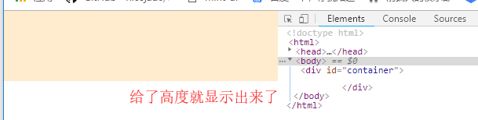

# 笔记

## div样式添加高度没有显示出来

原因：html给了高度，body没有给高度，这样body中的div元素无论给什么高度样式都无法显示出来

~~~！

<html>
    <head>
        <meta charset="utf-8">
        <title>11</title>
        
    </head>
    <body>
        

        

    </body>
</html>
~~~

